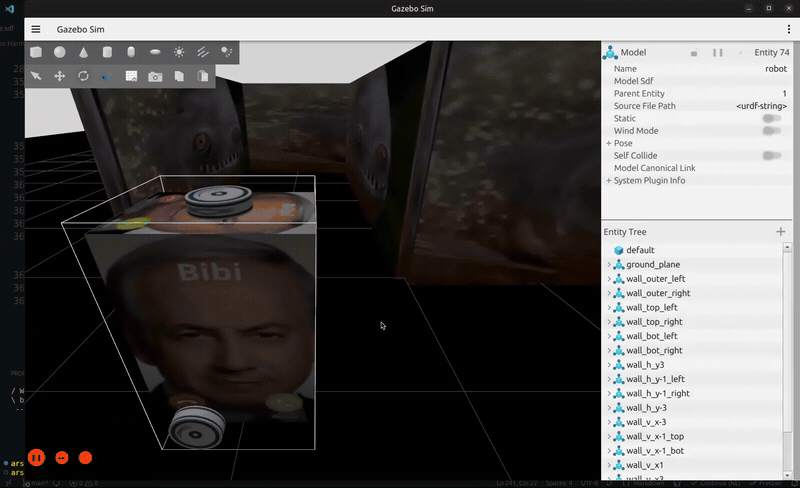
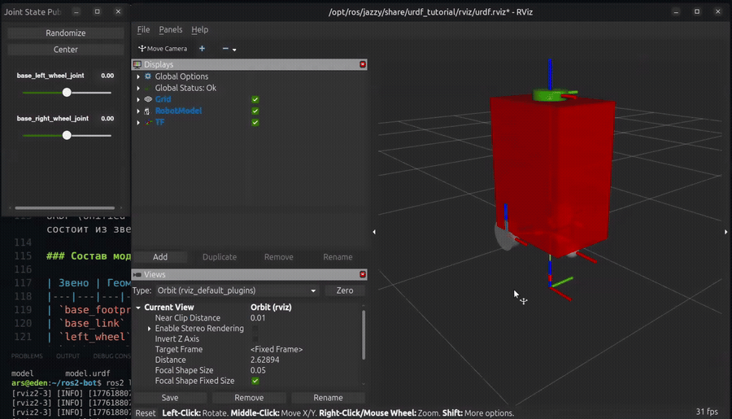
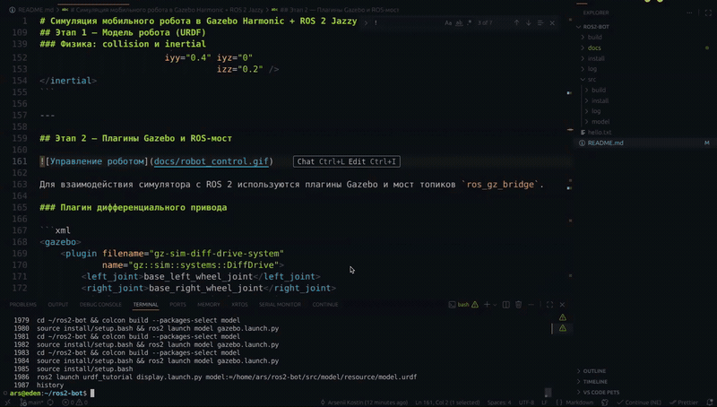
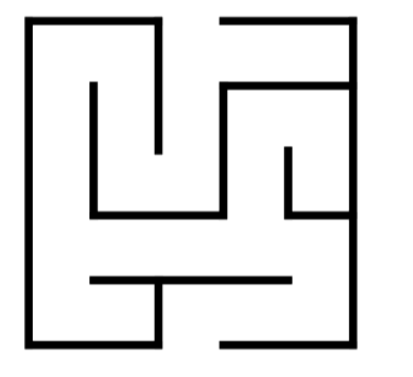

# Симуляция мобильного робота в Gazebo Harmonic + ROS 2 Jazzy

Лабораторная работа: создание модели мобильного робота, лабиринта и автономного алгоритма его прохождения с использованием данных лидара.



---

## Содержание

- [Стек технологий](#стек-технологий)
- [Структура проекта](#структура-проекта)
- [Быстрый старт](#быстрый-старт)
- [Этап 1 — Модель робота (URDF)](#этап-1--модель-робота-urdf)
- [Этап 2 — Плагины Gazebo и ROS-мост](#этап-2--плагины-gazebo-и-ros-мост)
- [Этап 3 — Лабиринт (SDF)](#этап-3--лабиринт-sdf)
- [Этап 4 — Алгоритм прохождения лабиринта](#этап-4--алгоритм-прохождения-лабиринта)
- [Запуск и управление](#запуск-и-управление)

---

## Стек технологий

| Компонент | Версия |
|---|---|
| ОС | Ubuntu 24.04 LTS |
| ROS 2 | Jazzy |
| Симулятор | Gazebo Harmonic |
| Язык скрипта | Python 3 |

---

## Структура проекта

```
ros2-bot/
└── src/
    └── model/
        ├── model/
        │   └── maze_solver.py       # скрипт прохождения лабиринта
        ├── resource/
        │   └── model.urdf           # описание модели робота
        ├── launch/
        │   └── gazebo.launch.py     # launch-файл
        ├── worlds/
        │   ├── maze.sdf             # мир с лабиринтом
        │   └── textures/            # текстуры и STL финишной модели
        ├── setup.py
        └── package.xml
```

---

## Быстрый старт

### Зависимости

```bash
sudo apt install ros-jazzy-ros-gz ros-jazzy-robot-state-publisher ros-jazzy-ros-gz-bridge
```

### Сборка

```bash
cd ~/ros2-bot
source /opt/ros/jazzy/setup.bash
colcon build --packages-select model
source install/setup.bash
```

### Запуск симуляции

```bash
ros2 launch model gazebo.launch.py
```

### Запуск алгоритма прохождения лабиринта

В новом терминале:

```bash
source ~/ros2-bot/install/setup.bash
ros2 run model maze_solver
```

Остановка: **Ctrl+C** — робот остановится, в терминал выведется сообщение о прерывании.

### Визуализация лучей лидара

В интерфейсе Gazebo: **кнопка ⋮ (Plugins) → Visualize Lidar → выбрать топик `/scan`**.

### Ручное управление (для проверки)

```bash
# Движение вперёд
ros2 topic pub /cmd_vel geometry_msgs/msg/Twist \
  "{linear: {x: 0.5}, angular: {z: 0.0}}" --rate 10

# Остановка
ros2 topic pub /cmd_vel geometry_msgs/msg/Twist \
  "{linear: {x: 0.0}, angular: {z: 0.0}}" --once

# Просмотр данных лидара
ros2 topic echo /scan --once
```

---

## Этап 1 — Модель робота (URDF)



URDF (Unified Robot Description Format) — стандартный XML-формат описания роботов в ROS 2. Модель состоит из звеньев (`<link>`) и соединений (`<joint>`).

### Состав модели

| Звено | Геометрия | Масса | Описание |
|---|---|---|---|
| `base_footprint` | — | — | Виртуальное корневое звено, проекция на землю |
| `base_link` | box 0.6×0.4×0.8 м | 5.0 кг | Корпус робота |
| `left_wheel` | cylinder r=0.1, l=0.05 м | 0.5 кг | Левое ведущее колесо |
| `right_wheel` | cylinder r=0.1, l=0.05 м | 0.5 кг | Правое ведущее колесо |
| `caster_wheel` | sphere r=0.05 м | 0.1 кг | Опорный шар (спереди снизу) |
| `lidar` | cylinder r=0.1, l=0.05 м | 0.1 кг | Лидар на крыше корпуса |

### Дерево соединений

```
base_footprint
└── base_link  (fixed, +z 0.4м)
    ├── left_wheel   (continuous, ось Y, смещение -0.15, +0.225, 0)
    ├── right_wheel  (continuous, ось Y, смещение -0.15, -0.225, 0)
    ├── caster_wheel (fixed, смещение +0.2, 0, -0.05)
    └── lidar        (fixed, смещение 0, 0, +0.825)
```

Колёса — тип `continuous` (вращение без ограничений по углу). Кастор и лидар — `fixed`.

### Физика: collision и inertial

Для корректной симуляции каждое звено содержит два дополнительных блока помимо `<visual>`:

**`<collision>`** — геометрия для расчёта столкновений физическим движком. Идентична визуальной геометрии.

**`<inertial>`** — масса и симметричный тензор инерции 3×3. Без этого блока Gazebo считает объект невесомым, симуляция становится нестабильной или некорректной.

```xml
<inertial>
    <mass value="5.0" />
    <origin xyz="0 0 0.4" rpy="0 0 0" />
    <inertia ixx="0.3" ixy="0" ixz="0"
                        iyy="0.4" iyz="0"
                                  izz="0.2" />
</inertial>
```

---

## Этап 2 — Плагины Gazebo и ROS-мост



Для взаимодействия симулятора с ROS 2 используются плагины Gazebo и мост топиков `ros_gz_bridge`.

### Плагин дифференциального привода

```xml
<gazebo>
    <plugin filename="gz-sim-diff-drive-system"
            name="gz::sim::systems::DiffDrive">
        <left_joint>base_left_wheel_joint</left_joint>
        <right_joint>base_right_wheel_joint</right_joint>
        <wheel_separation>0.45</wheel_separation>
        <wheel_radius>0.1</wheel_radius>
        <topic>/cmd_vel</topic>
        <odom_topic>/odom</odom_topic>
    </plugin>
</gazebo>
```

Плагин принимает команды из топика `/cmd_vel` (`geometry_msgs/Twist`) и преобразует линейную скорость `v` и угловую `ω` в скорости вращения колёс по формулам:

```
v_left  = (v - ω * d/2) / r
v_right = (v + ω * d/2) / r
```

где `d = 0.45` м — расстояние между колёсами, `r = 0.1` м — радиус колеса.

### Плагин лидара

```xml
<gazebo reference="lidar">
    <sensor name="lidar_sensor" type="gpu_lidar">
        <topic>/scan</topic>
        <update_rate>10</update_rate>
        <lidar>
            <scan>
                <horizontal>
                    <samples>360</samples>
                    <min_angle>-3.14159</min_angle>
                    <max_angle>3.14159</max_angle>
                </horizontal>
            </scan>
            <range>
                <min>0.12</min>
                <max>10.0</max>
            </range>
        </lidar>
    </sensor>
</gazebo>
```

Лидар сканирует горизонтальную плоскость 360° с частотой 10 Гц, 360 точек на оборот. Публикует `sensor_msgs/LaserScan` в топик `/scan`. Поле `ranges[i]` содержит расстояние до ближайшего объекта под углом `angle_min + i * angle_increment`.

### Мост топиков ROS 2 ↔ Gazebo

Gazebo Harmonic и ROS 2 используют разные транспортные уровни. `ros_gz_bridge` проксирует топики в обе стороны:

| Топик | Тип ROS 2 | Направление |
|---|---|---|
| `/cmd_vel` | `geometry_msgs/Twist` | ROS 2 → Gazebo |
| `/scan` | `sensor_msgs/LaserScan` | Gazebo → ROS 2 |
| `/odom` | `nav_msgs/Odometry` | Gazebo → ROS 2 |

---

## Этап 3 — Лабиринт (SDF)


### Параметры лабиринта

- Размер: 5×5 клеток, 1 клетка = 2×2 м → общий размер 10×10 м
- Вход: северная сторона, центральный проход (col 2)
- Выход: южная сторона, центральный проход (col 2)
- Высота стен: 1.5 м, толщина: 0.15 м

### Схема лабиринта



### Система координат

Координаты центрированы относительно начала: X и Y от −5 до +5.

| Точка | Координаты |
|---|---|
| Центр лабиринта | (0, 0) |
| Вход (старт робота) | x=0, y=+4 |
| Выход | x=0, y=−5 |
| Левая внешняя стена | x=−5 |
| Правая внешняя стена | x=+5 |

### SDF-формат

Лабиринт описан в формате SDF 1.8. Каждая стена — статичная модель. Смежные стены одного направления объединены в единые модели:

```xml
<model name="wall_outer_left">
    <static>true</static>
    <pose>-5 0 0.75 0 0 0</pose>
    <link name="link">
        <collision name="c">
            <geometry><box><size>0.15 10 1.5</size></box></geometry>
        </collision>
        <visual name="v">
            <geometry><box><size>0.15 10 1.5</size></box></geometry>
        </visual>
    </link>
</model>
```

### Launch-файл

`gazebo.launch.py` запускает всё одной командой:

1. **Gazebo** с файлом `maze.sdf`
2. **`robot_state_publisher`** — читает URDF и публикует `/robot_description`
3. **`ros_gz_sim create`** — спавнит робота из `/robot_description` у входа
4. **`ros_gz_bridge`** — мост топиков

---

## Этап 4 — Алгоритм прохождения лабиринта


### Принцип работы

Алгоритм — **следование по левой стене с конечным автоматом**. Классическое правило одной руки работает для просто связных лабиринтов. Конечный автомат с памятью состояния исключает зацикливание на месте при отсутствии стены рядом.

### Обработка данных лидара

Массив `ranges[360]` делится на три сектора в системе координат робота:

```
         FRONT (0°)
            ↑
 LEFT(90°) ←+→ RIGHT(-90°)
```

```python
def sector_min(self, msg, center_deg, half_deg):
    center = math.radians(center_deg)
    half   = math.radians(half_deg)
    result = float('inf')
    for i, r in enumerate(msg.ranges):
        angle = msg.angle_min + i * msg.angle_increment
        if abs(angle - center) <= half and math.isfinite(r) and r > 0.01:
            result = min(result, r)
    return result

front = sector_min(msg,   0, 25)   # ±25° спереди
left  = sector_min(msg,  90, 25)   # ±25° слева
right = sector_min(msg, -90, 25)   # ±25° справа
```

### Конечный автомат

```
              ┌─────────────────────────────────────────────┐
              │                                             │
              ▼                  front < 0.55м             │
  ┌──────────────────────┐  ←──────────────────────────    │
  │      SEARCHING       │                                  │
  │  едем прямо, ищем    │──── left < 1.0м ────────────►  FOLLOWING
  │  левую стену         │                                  │
  └──────────────────────┘                                  │
                                                  left < 0.35м → корр. вправо
                                                  0.35м < left < 1.0м → прямо
                                                  left > 1.0м ──────────────►
                                                                             │
                                                                        TURNING_LEFT
                                                                        доворот влево
                                                                        до left < 1.0м
                                                                             │
                                                                             └──► FOLLOWING
```

### Пороговые значения

| Параметр | Значение | Описание |
|---|---|---|
| `FRONT_THRESH` | 0.55 м | расстояние спереди для разворота |
| `WALL_CLOSE` | 0.35 м | слишком близко к левой стене |
| `WALL_FAR` | 1.0 м | стена слева исчезла |
| `LINEAR_SPEED` | 0.3 м/с | скорость движения вперёд |
| `ANGULAR_SPEED` | 0.5 рад/с | скорость поворота |

### Определение выхода из лабиринта

Выход фиксируется по двум условиям одновременно:

1. Пройдено не менее **6 м** по одометрии (исключает ложное срабатывание на старте)
2. Все три сектора — `front`, `left`, `right` — свободны на расстояние > **2.5 м** (открытое пространство за пределами лабиринта)

```python
if (self.travelled > MIN_TRAVEL
        and front > EXIT_DIST
        and left  > EXIT_DIST
        and right > EXIT_DIST):
    self.stop()
    self.get_logger().info(f'Лабиринт пройден! Пройдено {self.travelled:.1f} м.')
```

После срабатывания: робот останавливается (`Twist()` с нулями), скрипт завершается с сообщением об успехе. При нажатии **Ctrl+C** — такая же остановка с сообщением о прерывании.
